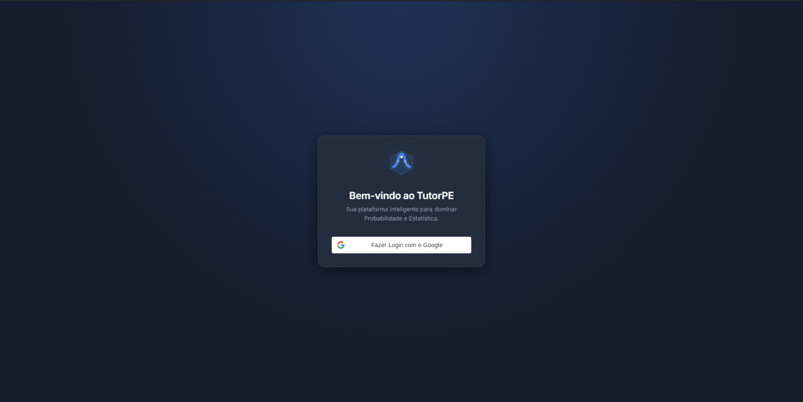
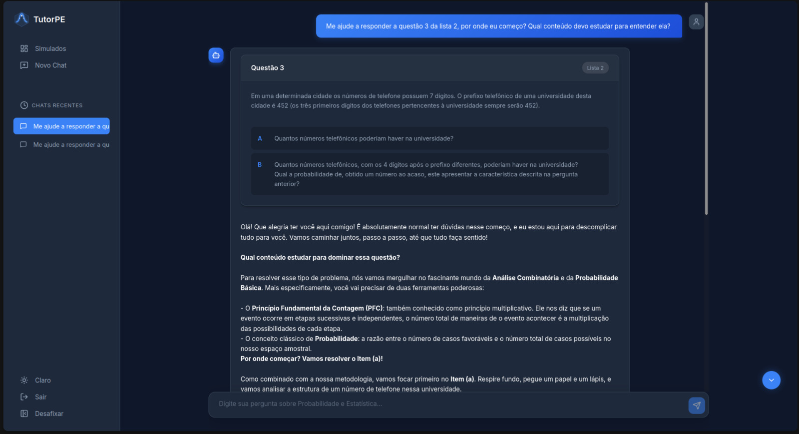
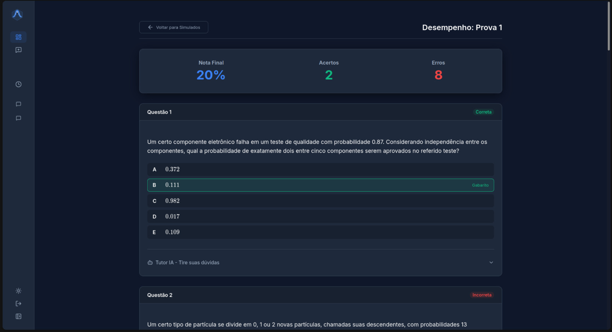

<p align="center">
  
</p>

# TutorPE

TutorPE é uma plataforma de estudos com IA voltada para a disciplina de **Probabilidade e Estatística**. A ideia é simples: em vez de o aluno travar sozinho em uma questão, ele conversa com um tutor virtual que explica o conteúdo necessário passo a passo, resolve exemplos com fórmulas em LaTeX e ainda oferece simulados no estilo prova para o aluno praticar e acompanhar o próprio desempenho.

## ✨ O que o TutorPE faz

O aplicativo tem dois grandes pilares: **o tutor de chat** e **os simulados**.

### Chat com o Tutor IA

<p align="center">
  
</p>

O aluno pode digitar livremente qualquer dúvida sobre a matéria ou perguntar sobre uma questão específica de uma lista. Nesse caso, o tutor mostra o enunciado em um card e responde de forma didática: primeiro contextualiza qual conteúdo é necessário para resolver o problema, e só depois caminha junto com o aluno resolvendo item por item. As respostas suportam fórmulas matemáticas renderizadas (via LaTeX/KaTeX).

### Simulados

<p align="center">
  
</p>

O aluno pode criar simulados a partir de provas reais já cadastradas na base, para treinar em condições parecidas com uma avaliação. Ao finalizar, vê seu desempenho — nota final, acertos e erros, com o detalhamento de cada questão e o gabarito destacado. O grande diferencial é que, em cada questão, o aluno pode acionar o **Tutor IA** diretamente ali, dentro do resultado, e pedir uma explicação de como chegar à resposta correta.

## 🧩 Arquitetura do projeto

O projeto é dividido em dois serviços independentes: `frontend` e `backend`.

```
TutorPE/
├── backend/     # API em Django/DRF + integração com IA
└── frontend/    # SPA em React/TypeScript
```

### 🔙 Backend

O backend é responsável por toda a regra de negócio: autenticação, histórico de conversas, geração das respostas do tutor de IA, e a lógica dos simulados (criação, correção e cálculo de desempenho).

- **Framework**: Django + Django REST Framework, expondo uma API REST sob o prefixo `/api/`.
- **Banco de dados**: PostgreSQL.
- **IA**: integração com o **Google Gemini** (via [PydanticAI](https://ai.pydantic.dev/)) para gerar as explicações do tutor.
- **Autenticação**: login com Google (credencial validada no backend) + JWT para autenticar as demais rotas.
- **ETL**: scripts próprios (`ETL/`, `import_questions`, `import_sim_questions`) para importar a base de questões (em LaTeX) e as provas usadas nos simulados.
- **Infra**: containerizado com Docker e Docker Compose, o que sobe a API e o banco juntos.

Principais rotas da API: login com Google, chat com o tutor (`/api/chat/`) e histórico de conversas, além de todo o fluxo de simulados (`/api/simulados/`) — criação, listagem, resposta de questões e finalização com nota. Detalhes completos de cada endpoint estão em [`backend/README.md`](backend/README.md).

### 🎨 Frontend

O frontend é a interface com a qual o aluno interage: as telas de chat e de simulados mostradas acima.

- **Framework**: React 19 + TypeScript, com build via Vite.
- **Roteamento**: React Router.
- **Estilo**: SCSS Modules, com suporte a tema claro/escuro.
- **Renderização de matemática**: KaTeX / react-katex, para exibir fórmulas em LaTeX nas respostas do tutor.
- **Autenticação**: `@react-oauth/google`, consumindo a API de login do backend.
- **Estrutura principal** (`frontend/src`):
  - `pages/Login` — tela de login.
  - `pages/Chat` — chat com o Tutor IA.
  - `pages/Simulados` — dashboard/listagem de simulados.
  - `pages/SimuladoPlayer` — realização de um simulado (questão por questão).
  - `pages/SimuladoPerformance` — tela de desempenho/resultado, com o Tutor IA embutido por questão.
  - `contexts/` — contextos globais de autenticação, chat e tema.
  - `services/` — chamadas HTTP para a API do backend (via Axios).

## 🚀 Como rodar o projeto

Backend e frontend rodam como serviços separados.

### Backend

```bash
cd backend
cp .env.example .env   # preencha as variáveis (Gemini, Google OAuth, JWT, banco)
docker-compose up --build
```

A API sobe em `http://localhost:8000`. Depois, importe a base de questões:

```bash
docker-compose exec tutor_pe_backend python manage.py import_questions
docker-compose exec tutor_pe_backend python manage.py import_sim_questions
```

Mais detalhes (variáveis de ambiente, endpoints da API) em [`backend/README.md`](backend/README.md).

### Frontend

```bash
cd frontend
npm install
npm run dev
```

A aplicação sobe em modo de desenvolvimento via Vite (por padrão em `http://localhost:5173`).

## 🛠️ Tecnologias

| Camada | Stack |
|---|---|
| Frontend | React, TypeScript, Vite, React Router, SCSS, KaTeX |
| Backend | Python, Django, Django REST Framework, PostgreSQL |
| IA | Google Gemini (via PydanticAI) |
| Infra | Docker, Docker Compose |
